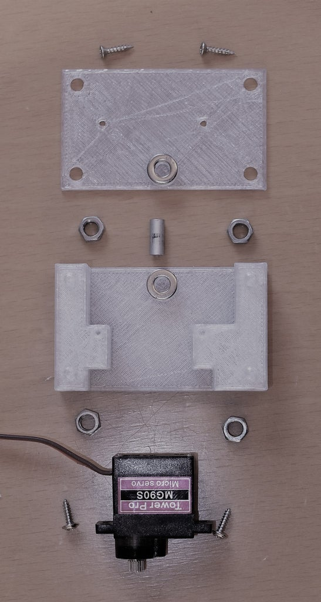

# Linear and Rotary Actuator

This Instructable is about how to make a  linear actuator with a rotatable shaft. This means you can move an  object forwards and backwards and rotate it at the same time. It is  possible to move an object 45 mm (1.8 inch) back and forth and rotate it 180 degrees.

The costs are approximately $50. All the parts can be either 3D printed or bought in a hardware store.

The used motors are two commercially available servo motors. Beside the low price servos have a useful characteristic: Servos do not need any  additional control logic. In case you are using an Arduino [1] and its  Servo library [2], the writing of a value between 0 and 180 is directly  the position of the servo motor and in our case the position of the  actuator. I only know the Arduino but I am sure on other platforms it is also very simple to control servos and hence this actuator.

To  build it you need a standing drill machine and a 4.2 mm metal drill. You are going to drill out M4 nuts to be your sleeve bearings.

Further you need a good bench vice and a screw die to cut a M4 thread on a  metal rod. For the fixation of the rods a M4 screw tap is required.

**Supplies**

 1 Standard Servo Tower Pro MG946R. Comes with servo arm, 4 M2 mounting screws and 4 d3 brass hulls

 1 Micro Servo Tower Pro MG90S. Comes  with servo arm and 2 mounting screws 

11 M2 x l10 mm flat headed screw 

 4 M4 washer

 6 M4 nut

 1 Snap ring d4 mm

 1 Paperclip d1 mm 

 1 Wooden dowel d6 x l120 

 2 Steel or aluminum rod d4 x l166 with M4 x l15 thread on one end 

 1 Steel or aluminum rod d4 x l14 with a snap ring notch 

 1 Steel or aluminum rod d4 x l12 

Legend: l:length in millimeters, d:diameter in millimeters

## Step 1: 3D Printed Parts

You either need to print the left-sided or  right-sided parts. The pictures in this Instructable show a left-sided  LnR Actuator (Looking from the front, the wooden dowel is on the left  side).

If you do not have a 3D printer, I recommend looking for a 3D printing service nearby.

## Step 2: Slider Bearings

As bearings, the M4 nuts are used! For that,  you drill out the (M4/3.3 mm) holes with the 4.2 mm metal drill. Press  the drilled out M4 nuts into the openings in the slider.

Glue 2 M4 washers onto the slider and the slider top.

## Step 3: Mirco Servo and Extension Arm

Mount the Micro Servo onto the slider.

On the right side you see the extension arm and the remaining 2 M4 nuts.  Press the drilled out M4 nuts into the openings of the extension arm.

## Step 4: Slider and Rotateable Shaft

Assemble slider, extension arm and slider top. Use the small 12 mm long metal rod as the axis.

At the bottom of the picture you see the flange that is attached to the Micro Servo arm.

You need to drill a 1.5 mm hole into the wooden dowel (bottom right of the picture), otherwise the wood will break.

## Step 5: Servo Joint

Drill a 4.2 mm hole into the standard servo arm and add a notch to the 14 mm metal rod for the snap ring.

Glue one of the washers onto the servo arm.

This is how you stack the components from top to bottom:

1) Mount the snap ring onto the axis

2) Add a washer

3) Hold the servo arm under the extension arm and press the assembled axis through it.

4) Add some glue to the fixation ring and press it from the bottom onto the axis.

The picture is not up-to-date. Instead of the second snap ring it shout  show the fixation ring. The idea with the fixation ring is an  enhancement to the original design.

## Step 6: Servo Mount

The standard servo is attached to the  actuator. In order to bring the servo through the opening, you need to  remove its bottom cap so you can bend the cable down.

The mounting screws go into the messing hulls first, then through the holes in the  actuator. Drill the screws into the fixation blocks which are put below  the LnR-Base.

## Step 7: Longitudinal Motion

With the M4 screw tap you cut a thread into the 3.3 mm holes of the back plane of the LnR-Base.

The slider move on the two metal rods. These are pushed through the 4.2 mm  front  holes of the LnR-Base, then through the slider bearings and  fixated with the M4 thread in the back plane of the actuator.

## Step 8: Cover

That is the LnR Actuator!

To fix the Micro Servo cable, a part of a paper clip is used. Mount the hood onto the actuator and you are done.

