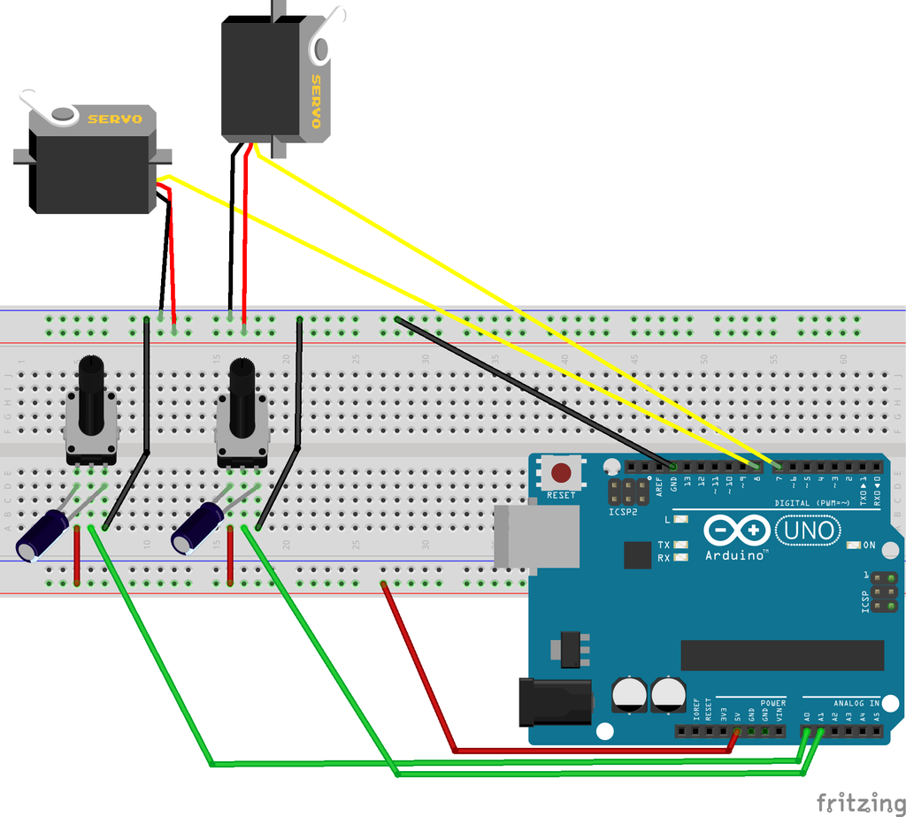

# Linear and Rotary Actuator

https://www.youtube.com/embed/AOaQP5htdsE?feature=oembed&autoplay=1

This Instructable is about how to make a  linear actuator with a rotatable shaft. This means you can move an  object forwards and backwards and rotate it at the same time. It is  possible to move an object 45 mm back and forth and rotate it 180 degrees.

The used motors are two commercially available servo motors. Beside the low price servos have a useful characteristic: Servos have already integrated control logic to be absolutely positioned. Additional position read-out modules are therefore not required. For the Arduino [1], there is its Servo library [2]. I am sure other platforms have similar libraries.

To  build it you need a standing drill machine and a 4.2 mm metal drill. You are going to drill out M4 nuts. These are going to be your sleeve bearings.

To cut the threads on the metal shafts, you need a good bench vice and a M4 thread cutter. And also a M4 screw tap for the fixation of the shafts is required.

The costs are approximately USD 35. All the parts can be either 3D printed or bought in a hardware store.

**Supplies**

 1 Standard Servo Tower Pro MG946R. Comes with servo arm, 4 M2 mounting screws and 4 d3 brass sleeves

 1 Micro Servo Tower Pro MG90S. Comes  with servo arm and 2 mounting screws 

11 M2 x l10 mm flat headed screw 

 4 M4 washer

 6 M4 nut

 1 Snap ring d4 mm

 1 Paperclip d1 mm 

 1 Wooden rod d6 x l120 

 2 Steel or aluminum shaft d4 x l166 with M4 x l8 thread on one end 

 1 Steel or aluminum rod d4 x l14 with a snap ring notch 

 1 Steel or aluminum rod d4 x l12 

 1 3D Printer

105g PLA filament

Legend: l:length in millimeters, d:diameter in millimeters

## Step 1: 3D Printed Parts

You either need to print the left-sided or  right-sided parts. The pictures in this Instructable show a left-sided  LnR Actuator (Looking from the front, the wooden rod is on the left  side).

You can use PLA with 20% infill. If you do not have a 3D printer, I recommend looking for a 3D printing service nearby.

## Step 2: Carriage Bearings

As bearings, the M4 nuts are used! For that,  you drill out the (M4/3.3 mm) holes with the 4.2 mm metal drill. Press  the drilled out M4 nuts into the openings in the carriage.

Glue 2 M4 washers onto the carriage and the carriage lid.

## Step 3: Mirco Servo and Extension Arm

Mount the Micro Servo onto the carriage.

On the right side you see the extension arm and the remaining 2 M4 nuts.  Press the drilled out M4 nuts into the openings of the extension arm.

## Step 4: Carriage and Rotatable Shaft

Assemble carriage, extension arm and carriage lid. Use the small 12 mm long metal rod as the axis.

At the bottom of the picture you see the flange that is attached to the Micro Servo arm.

You need to drill a 1.5 mm hole into the wooden rod (bottom right of the picture), otherwise the wood will break.

## Step 5: Servo Joint

Drill a 4.2 mm hole into the standard servo arm and add a notch to the 14 mm metal rod for the snap ring.

Glue one of the washers onto the servo arm.

This is how you stack the components from top to bottom:

1) Mount the snap ring onto the axis

2) Add a washer

3) Hold the servo arm under the extension arm and press the assembled axis through it.

4) Add some glue to the fixation ring and press it from the bottom onto the axis.

The picture is not up-to-date. Instead of the second snap ring it shout  show the fixation ring. The idea with the fixation ring is an  enhancement to the original design.

## Step 6: Servo Mount

The standard servo is attached to the  actuator. In order to bring the servo through the opening, you need to  remove its bottom cap so you can bend the cable down.

The mounting screws go into the messing sleeves first, then through the holes in the  actuator. Drill the screws into the fixation blocks which are put below  the LnR-Base.

## Step 7: Longitudinal Motion

With the M4 screw tap you cut a thread into the 3.3 mm holes of the back plane of the LnR-Base.

The carriage moves on the two metal rods. These rods are pushed through the 4.2 mm  front  holes of the LnR-Base, then through the carriage's bearings and  fixated with the M4 thread in the rear plane of the actuator.

## Step 8: Cover

That is the LnR Actuator!

To fix the Micro Servo cable, a part of a paper clip is used. Mount the hood onto the actuator and you are done.

## Step 9: Arduino Sketch (optional)

https://www.youtube.com/embed/eBcqPfLJKAA?feature=oembed&autoplay=1

Connect two potentiometers to the Arduino inputs A0 and A1. The signal pins are 7 for rotary and 8 for longitudinal motion.

It is important that you take the 5 Volts from the Arduino for the  potentiometers and not from the external 5 V power supply. To drive the  servos you have to use an external power supply.

## Step 10: Beyond a Programming Example (optional)

https://www.youtube.com/embed/KJdUGMOCTKk?feature=oembed&autoplay=1

This is how I cancel systematic errors in the  software that controls the LnR Actuator. By eliminating the positioning  error due to mechanical transformation and due to mechanical play, a  positioning accuracy of 0.5 millimeters in longitudinal direction and 1 degree in rotary motion is possible.

Mechanical transformation: Arduinos map function [5] can be written as: *f(x) = a + bx*. For the demo data set [6], the maximum deviation is 1.9 mm. This means  at some point, the position of the actuator is almost 2 millimeters away from the measured value. 

With a polynomial with a degree of 3, *f(x) = a + bx + cx^2 + dx^3*, the maximum deviation for the demo data is 0.3 millimeters; 6 times  more accurate. To determine the parameters a, b, c and d, you have to  measure at least 5 points. The demo data set has more than 5 measurement points, but 5 are sufficient. 

Mechanical play:  Due to  the mechanical play, there is an offset (called backlash) in the position if you move the  actuator first forwards and then backwards, or if you move it clockwise  and then counter clockwise. In the longitudinal direction, the actuator  has mechanical play in the two joints between the servo arm and the  carriage. For the rotary motion, the actuator has mechanical play between  the carriage and the shafts. The servo motors have also some mechanical  play themselves. 
To cancel the mechanical play, the rules are: 
  A) When moving forwards or clockwise, the formula is: *f(x) = P(x)*
  B) When moving backwards or counter clockwise, the formula is: *f(x) = P(x) + O(x)*

*P(x)* and *O(x)* are polynomials. B is the backlash that is added due to the mechanical  play. To determine the polynomial parameters, measure 5 points when  moving in one direction and the same 5 points when moving in the  opposite direction.

If you are planning to control multiple servo  motors with an Arduino and I convinced you to do a software calibration  using polynomials, have a look at my prfServo Arduino library [4].

For the pencil lead drive video the prfServo library was used. For each of  the four servos a five point calibration was done in both directions.

Other systematic errors: The actuator has additional systematic errors: Friction, eccentricity  and the resolution of the used servo library and servo motors.

Maybe, more as a fun fact, the resolution of the Adafruit Servo Shield [3] is  0.15 mm in longitudinal direction! Here is why: The servo shield uses  the PCA9685 chip to produce the PWM signal. The PCA9685 is designed to  create PWM signals between 0 and 100 % and has 4096 values for that. But for a servo, only values of lets says 200 (880 μs) to 500 (2215 μs) are used. 45 mm hub divided by 300 is 0.15 mm. If you do the math for the  rotary motion, 180º divided by 300 points is 0.6º.

## Step 11: References

[1] Arduino: [ https://www.arduino.cc/](https://www.arduino.cc/)

[2] Servo library: [ https://www.arduino.cc/en/reference/servo](https://www.arduino.cc/en/reference/servo)

[3] Adafruit ServoShield: [ https://www.adafruit.com/product/1411](https://www.adafruit.com/product/1411)

[4] prfServo library: [ https://github.com/mrstefangrimm/prfServo](https://github.com/mrstefangrimm/prfServo)

[5] Arduino map function: [https://www.arduino.cc/reference/en/language/funct...](https://www.arduino.cc/reference/en/language/functions/math/map/)

[6] Example data set:
0 476
5 426
10 388
15 356
20 325
25 300
30 276
35 252
40 224
45 194

