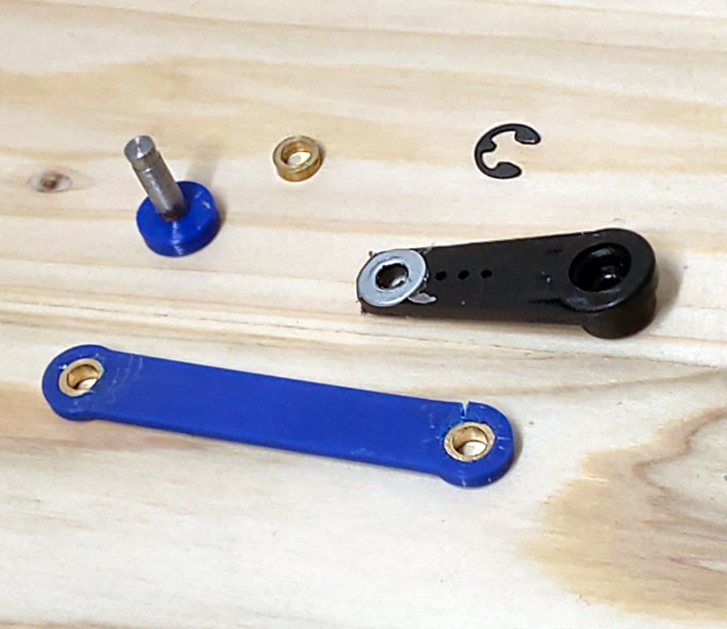
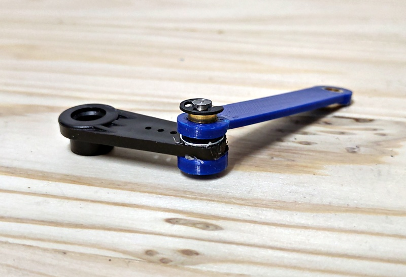

# Linear and Rotary Actuator With Brass Bearings

The Linear and Rotary (LnR) actuator is a linear servo with a rotatable shaft. This means you can move an  object forwards and backwards and rotate it at the same time. It is  possible to move an object 45 mm back and forth and rotate it 180 degrees.

To get an idea, check out the [3D model of the LnR Actuator](https://mrstefangrimm.github.io/). With the two sliders on the right you can simulate longitudinal and rotational motion.

The used motors are two commercially available servo motors. Beside the low price, servos have a useful characteristic: Servos have already integrated control logic in order to be absolutely positioned. Additional position read-out modules are therefore not required.

To  build it you need a lathe and metal drills (4.1 and 3.3 mm) to manufacture the sleeve bearings. A turning tool to create the snap ring notch is also required. Further you need a M4 screw tap and a M4 thread cutter.

This is a improved version of the [Linear and Rotary Actuator](https://www.instructables.com/Linear-and-Rotation-Actuator/). The advantages are:

- It makes less noise
- It is more accurate because it has less mechanical play and less friction

To build this improved version of the LnR Actuator, you will need a lathe to manufacture the sleeve bearings. The original LnR Actuator was explicitly designed so that it can be manufactured with of-the-shelve components.

The direct material costs are approximately USD 30.

**Supplies**

 1 Standard Servo Tower Pro MG946R. Comes with servo arm, 4 M2 mounting screws and 4 d3 brass sleeves

 1 Micro Servo JX PDI 9180MG. Comes  with servo arm and 2 mounting screws 

11 M2 x l10 mm flat headed screw

 2 Brass sleeve d6 x l8

 2 Threaded brass sleeve d6 x l8

 4 Brass sleeve d6 x l4

 2 Brass sleeve d6 x l3

 1 Brass sleeve d6 x l2

 3 M4 washer

 1 Snap ring d4

 1 Paperclip d1

 1 Wooden rod 6 x l120 

 2 Steel shaft d4 x l166 with M4 x l8 thread on one end 

 1 Steel rod d4 x l15 with a snap ring notch 

 1 Steel rod d4 x l12

 1 3D Printer

 105g PLA filament

 1 Lathe machine

 Legend: l:length in millimeters, d:diameter in millimeters

## Step 1: 3D Printed Parts

You either need to print the left-sided or  right-sided parts. The pictures in this Instructable show a left-sided  LnR Actuator.

You may use PLA with 20% infill. If you do not have a 3D printer, I recommend looking for a 3D printing service nearby.

## Step 2: Rotary Drive

Press the 4 mm long brass sleeves into the printed slider component. This is best done in a vice. Mount the micro servo with the supplied screws.

Use 2 M2 screws to attach the supplied servo cross arm to the printed flange.

Glue 2 M4 washers onto the slider and the slider cover.

## Step 3: Linear Drive

Press the 8 mm long brass sleeves into the printed base component. This is best done in a vice. The plain sleeves are mounted to the front and the threaded sleeves are mounted to the back side.

Attach the standard servo motor the the printed base component. In order to bring the servo through the opening, you need to  remove its bottom cap and bend the cable down. As shown in the picture, the cable of the micro servo has to go through the intended opening first. For fastening the servo motor, use supplied screws and brass hulls and the two printed servo fixation blocks.

## Step 4: Longitudinal Guides

Slide the metal shafts from the front through the sleeve bearings of the base component and the slider component. Then screw the shafts into the threaded sleeves on back side of the base component.

Attach the wooden rod the flange with a M2 screw. Drill a 1.5 mm hole into the wooden rod where the screw goes through, otherwise the wood will break.

Use one leg of the paperclip to fixate the cable of the micro servo the the base component.

## Step 5: Force Transmission

Press the 3 mm long brass sleeves into the printed servo arm extension component. Press metal rod with the snap ring notch into the printed fixation ring.

Drill a 4.1 mm hole into the supplied servo arm and glue a M4 washers onto the servo arm.

Put all the components together and add the snap ring for fixation.

## Step 6: Finalization

Position the servo motor to middle position and mount the servo arm to the servo motor. Move the slider to the position where bore of the extension arm matches with the bore of the slider. Attach the extension arm with the 12 mm long metal rod and mount the slider's lid with two M2 screws.

Mount the cover to the base component with six M2 screws.

That is the LnR Actuator!
